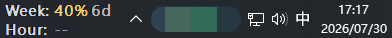
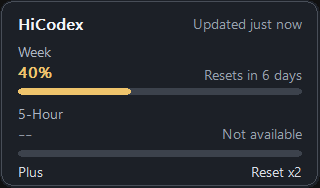

# HiCodex

[简体中文](#zh-cn) · [English](#en)

HiCodex 是一款轻量、非官方的 Windows Codex 额度查看工具。它常驻任务栏右侧，用两行文字显示周额度和 5 小时额度。

**无需安装、无需部署：下载 `HiCodex.exe`，双击即可使用。**

HiCodex is a lightweight, unofficial Windows taskbar meter for Codex usage. It displays your weekly and five-hour limits in two compact lines.

**No installation or deployment: download `HiCodex.exe` and double-click to run.**

**[下载最新版 / Download latest](../../releases/latest)**

<p align="center">
  
  <br><br>
  
</p>

---

<a id="zh-cn"></a>

## 简体中文

[简体中文](#zh-cn) · [English](#en)

### 功能

- 在 Windows 任务栏右侧显示 Codex 周额度和 5 小时额度
- 显示周额度距离下一次重置的剩余天数
- 鼠标悬停时显示额度详情、重置时间、订阅类型和更新时间
- 支持手动刷新和随 Windows 启动
- 可选将 Windows 10 任务栏图标居中
- 不显示账号名称或邮箱
- 原生 Windows 程序，无 WebView、Electron 或常驻网页运行环境

任务栏示例：

```text
Week: 62%  4d
Hour: 81%
```

百分比表示**剩余额度**。如果接口没有返回某个额度窗口，HiCodex 会显示 `--`。颜色阈值为：绿色 `51–100%`、黄色 `21–50%`、红色 `0–20%`；`Reset xN` 表示可用重置次数（如有）。

### 系统要求

- Windows 10（x64，已测试）
- Windows 11（x64，基础兼容，尚未完整验证）
- 已安装 Codex，并已使用 ChatGPT 账号登录

### 下载与运行

1. 从 [Releases](../../releases/latest) 下载最新版 `HiCodex.exe`，无需安装或部署。
2. 将文件放到你希望保存的位置。
3. 双击 `HiCodex.exe`。
4. HiCodex 会显示在任务栏右侧，无需安装。

首次运行时，Windows SmartScreen 可能因为程序尚未进行代码签名而显示“未知发布者”。

### 使用方法

- **查看额度：** 直接查看任务栏右侧的 Week 和 Hour。
- **查看详情：** 将鼠标悬停在 HiCodex 文字上。
- **打开设置：** 右键单击 HiCodex 文字。

右键菜单：

| 选项 | 作用 |
|---|---|
| Refresh now | 立即刷新额度 |
| Open Usage dashboard | 打开 Codex 官方额度页面 |
| Start with Windows | 设置为随 Windows 启动 |
| Center taskbar icons | 将 Windows 10 任务栏图标居中 |
| Exit HiCodex | 退出 HiCodex |

任务栏图标居中功能默认关闭，可随时通过右键菜单开启或关闭。

### 没有显示额度？

1. 确认 Codex 已安装并登录。
2. 打开一次 Codex，确认账号可以正常使用。
3. 右键单击 HiCodex，选择 **Refresh now**。
4. 如果某项仍显示 `--`，可能是当前账号没有返回对应的额度窗口。

### 兼容性与维护

- 当前支持主显示器的水平任务栏；副屏和垂直任务栏尚未完整支持。
- 更新：退出程序后下载新版并覆盖原 EXE。
- 卸载：先关闭 **Start with Windows**，再退出程序并删除 EXE。

### 隐私

HiCodex 通过 Codex 官方 App Server 接口读取当前登录账号的额度信息。它不会显示账号名称或邮箱，也不会读取浏览器 Cookie。

### 说明

HiCodex 是非官方开源项目，与 OpenAI 没有关联，也未获得 OpenAI 的认可或背书。

---

<a id="en"></a>

## English

[简体中文](#zh-cn) · [English](#en)

### Features

- Shows Codex weekly and five-hour limits on the right side of the Windows taskbar
- Shows the number of days until the weekly limit resets
- Displays usage details, reset times, plan type, and refresh time on hover
- Supports manual refresh and launch at Windows startup
- Optionally centers Windows 10 taskbar icons
- Does not display the account name or email address
- Native Windows application with no WebView, Electron, or persistent web runtime

Taskbar example:

```text
Week: 62%  4d
Hour: 81%
```

The percentage means **remaining capacity**. If a limit window is unavailable, HiCodex displays `--`. Colors indicate green `51–100%`, yellow `21–50%`, and red `0–20%`; `Reset xN` is the available reset-credit count when provided.

### Requirements

- Windows 10 (x64, tested)
- Windows 11 (x64, basic compatibility; not fully verified)
- Codex installed and signed in with a ChatGPT account

### Download and run

1. Download the latest `HiCodex.exe` from [Releases](../../releases/latest). No installation or deployment is required.
2. Move the file to the location where you want to keep it.
3. Double-click `HiCodex.exe`.
4. HiCodex appears on the right side of the taskbar. No installation is required.

Windows SmartScreen may show an “Unknown publisher” warning on first launch because the application is not yet code-signed.

### How to use

- **Check usage:** Read the Week and Hour values on the taskbar.
- **View details:** Hover over the HiCodex text.
- **Open settings:** Right-click the HiCodex text.

Right-click menu:

| Option | Action |
|---|---|
| Refresh now | Refresh usage immediately |
| Open Usage dashboard | Open the official Codex usage page |
| Start with Windows | Launch HiCodex when Windows starts |
| Center taskbar icons | Center Windows 10 taskbar icons |
| Exit HiCodex | Close HiCodex |

Taskbar icon centering is disabled by default and can be toggled at any time from the right-click menu.

### Usage is not displayed?

1. Make sure Codex is installed and signed in.
2. Open Codex once and confirm that the account is working.
3. Right-click HiCodex and select **Refresh now**.
4. If a value still shows `--`, the corresponding limit window may not be available for the current account.

### Compatibility and maintenance

- Horizontal taskbars on the primary display are supported; secondary-display and vertical taskbars are not fully supported yet.
- Update: exit HiCodex, download the new version, and replace the existing EXE.
- Uninstall: disable **Start with Windows**, exit HiCodex, and delete the EXE.

### Privacy

HiCodex reads usage information through the official Codex App Server interface. It does not display the account name or email address and does not read browser cookies.

### Disclaimer

HiCodex is an unofficial open-source project. It is not affiliated with, endorsed by, or sponsored by OpenAI.

## License

[MIT](LICENSE)