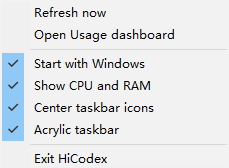

# HiCodex

[简体中文](#zh-cn) · [English](#en)

HiCodex 是一款轻量、非官方的 Windows 任务栏工具。它用两行文字显示 Codex 周额度和 5 小时额度，并可选显示 CPU 与内存占用率。

**无需安装、无需部署：下载 `HiCodex.exe`，双击即可使用。**

HiCodex is a lightweight, unofficial Windows taskbar meter for Codex limits with optional live CPU and memory usage.

**No installation or deployment: download `HiCodex.exe` and double-click to run.**

**[下载最新版 / Download latest](../../releases/latest)**

### 实验性预发布版：可选账号切换

`v0.3.3-beta.1`（`codex/experimental-account-switching` 分支）增加原生账号管理，不依赖 codex-auth、Node.js 或 codext。[下载实验版](https://github.com/fangzh5/hi-codex/releases/tag/v0.3.3-beta.1)。稳定版仍为 `v0.3.2`，上方最新版链接仍指向稳定版。

- 原有额度查看无需启用多账号，也不会自动创建账号库。
- 右键菜单 **Accounts (experimental)** → **Save current account** 保存当前登录账号。添加另一个账号时，先在 Codex 正常登录，再保存。
- 已使用 codex-auth：选择 **Import existing codex-auth accounts**，从同一个 `CODEX_HOME` 读取已登记的 ChatGPT 快照及别名，不修改它的文件或当前登录。也可通过 **Import auth JSON...** 导入 Codex 生成的 `auth.json`；这是内部凭据格式，并非保证长期兼容的公开标准，不支持 CPA 格式或 API Key 账号。
- 账号菜单默认隐藏邮箱、别名和工作区；在悬停面板点击眼睛按钮后可显示身份。每个账号保留独立编号，并显示工作区短标识，便于区分同邮箱账号。
- 当前选中的账号带勾且不可重复点击。保存、导入和切换成功后，结果在详情面板显示约 8 秒，无需点击“确定”；切换与恢复前仍需确认，失败时保留具体错误提示。
- 在子菜单点击账号后，先关闭 Codex 和其他账号切换工具，核对确认框中的目标，再手动重新打开 Codex。本地选择保存后，HiCodex 自动刷新额度验证访问，并重新隐藏账号身份。
- **Restore last switch backup** 可恢复最近一次切换前的凭据，也支持当前凭据文件缺失或 JSON 语法损坏的情况；检测到后续有效登录或凭据刷新时会拒绝覆盖，此时使用账号菜单重新选择。权限不足和无法读取文件不会被视为文件损坏。
- 独立账号库保存在 `$CODEX_HOME/hi-codex/accounts.dpapi`，使用 Windows DPAPI 绑定当前 Windows 用户加密，包含凭据与最近一次恢复备份。不能作为跨机器迁移文件；原始导入文件仍需自行妥善保管。
- 首版限 Windows 原生、ChatGPT 文件凭据模式。显式 `keyring`、`auto`、`ephemeral`、WSL 和环境凭据覆盖会阻止切换，不影响额度查看。未设置凭据存储模式时按 Codex 的默认文件模式处理；不会修改你的 Codex 配置。
- 导入是一次性复制，账号库和别名不自动同步，重复导入不覆盖已有快照。请不要交替使用多个管理器操作同一组旧快照，刷新后的凭据可能让其他副本失效；需要时重新在 Codex 登录并保存当前账号。
- codex-auth 导入会跳过损坏、不支持、未登记和重复的快照，并显示新增与跳过数量；手动选择的 JSON 批量文件仍须全部有效才会导入。
- 文件替换失败时保留恢复副本，必要时自动还原原文件；账号库主文件缺失时可读取恢复副本。正常写入完成后会清理副本，异常中断遗留的 `.hicodex-backup` 与 `.hicodex-*.tmp` 文件可能包含凭据，应妥善保管。
- 非法或损坏的账号库只影响账号管理；额度查看继续走原有 App Server 接口。仍需在真实 Windows 桌面上手动验收，暂不作为稳定功能发布。

Experimental accounts are opt-in and independent of codex-auth. Use the **Accounts (experimental)** menu to save the current ChatGPT login, import Codex-generated auth JSON or registered codex-auth snapshots, switch accounts, or restore the last switch backup. Close Codex before switching and reopen it manually. Snapshots are encrypted using Windows user-scoped DPAPI. File credentials and Windows-native Codex are supported; API keys, WSL and keyring/auto/ephemeral modes are not. Imports do not change the active login or overwrite existing snapshots. Existing quota viewing remains available without account setup. [v0.3.3-beta.1](https://github.com/fangzh5/hi-codex/releases/tag/v0.3.3-beta.1) is a prerelease; v0.3.2 remains the latest stable release. Desktop acceptance testing is still required before stable promotion.

<p align="center">
  
</p>

<p align="center">
  
  &nbsp;&nbsp;
  
</p>

---

<a id="zh-cn"></a>

## 简体中文

[简体中文](#zh-cn) · [English](#en)

### 功能

- 在 Windows 任务栏右侧显示 Codex 周额度和 5 小时额度
- 显示周额度和 5 小时额度距离下一次重置的剩余时间
- 鼠标悬停时显示额度详情、重置时间、订阅类型和更新时间
- 支持手动刷新和随 Windows 启动
- 可选将 Windows 10 任务栏图标居中
- 可选在额度左侧显示 CPU 和 RAM 占用率
- 悬停面板提供眼睛按钮：默认以 `*****` 隐藏账户，点击后显示完整邮箱，方便区分多个账户
- 原生 Windows 程序，无 WebView、Electron 或常驻网页运行环境

任务栏示例：

```text
CPU: 13%   Week: 62% 4d
RAM: 43%   Hour: 81% 2h
```

百分比表示**剩余额度**。如果接口没有返回某个额度窗口，HiCodex 会显示 `--`。颜色阈值为：绿色 `51–100%`、黄色 `21–50%`、红色 `0–20%`；`Reset xN` 表示可用重置次数（如有）。

### 系统要求

- Windows 10（x64，已测试）
- Windows 11（x64，基础兼容，尚未完整验证）
- 已安装 Codex，并已使用 ChatGPT 账号登录

### 下载与运行

1. 从 [Releases](../../releases/latest) 下载最新版 `HiCodex.exe`，无需安装或部署。
2. 将文件放到你希望保存的位置。
3. 双击 `HiCodex.exe`。
4. HiCodex 会显示在任务栏右侧，无需安装。

首次运行时，Windows SmartScreen 可能因为程序尚未进行代码签名而显示“未知发布者”。

### 使用方法

- **查看额度：** 直接查看任务栏右侧的 Week 和 Hour。
- **查看详情：** 将鼠标悬停在 HiCodex 文字上。
- **打开设置：** 右键单击 HiCodex 文字。

右键菜单：

| 选项 | 作用 |
|---|---|
| Refresh now | 立即刷新额度 |
| Open Usage dashboard | 打开 Codex 官方额度页面 |
| Start with Windows | 设置为随 Windows 启动 |
| Show CPU and RAM | 在额度左侧显示实时 CPU 和内存占用率 |
| Center taskbar icons | 将 Windows 10 任务栏图标居中 |
| Acrylic taskbar | 为整个任务栏启用深色半透明磨砂效果 |
| Exit HiCodex | 退出 HiCodex |

CPU/RAM、任务栏图标居中和 Acrylic 毛玻璃默认关闭，可分别通过右键菜单开启或关闭。
CPU/RAM 每 2 秒刷新；RAM 表示系统物理内存占用率。颜色按占用率变化：深蓝 `0–24%`、绿色 `25–49%`、橙色 `50–74%`、红色 `75–100%`；绿、橙、红与额度显示使用同一组颜色。
Acrylic 需要开启 Windows 的“透明效果”。取消 Acrylic 或退出 HiCodex 时，会恢复启用前的任务栏样式。

### 没有显示额度？

1. 确认 Codex 已安装并登录。
2. 打开一次 Codex，确认账号可以正常使用。
3. 右键单击 HiCodex，选择 **Refresh now**。
4. 如果某项仍显示 `--`，可能是当前账号没有返回对应的额度窗口。

### 兼容性与维护

- 当前支持主显示器的水平任务栏；副屏和垂直任务栏尚未完整支持。
- 更新：退出程序后下载新版并覆盖原 EXE。
- 卸载：先关闭 **Start with Windows**，再退出程序并删除 EXE。

### 隐私

HiCodex 通过 Codex 官方 App Server 接口读取当前登录账号的额度信息。悬停面板默认以 `*****` 隐藏账户，点击眼睛按钮后显示完整邮箱；再次点击即可隐藏，方便截图。选择在本次运行中保持，重启后恢复隐藏。不会读取浏览器 Cookie。账户标识随额度刷新更新；刷新失败时标注为上次读取的账户。

### 说明

HiCodex 是非官方开源项目，与 OpenAI 没有关联，也未获得 OpenAI 的认可或背书。

---

<a id="en"></a>

## English

[简体中文](#zh-cn) · [English](#en)

### Features

- Shows Codex weekly and five-hour limits on the right side of the Windows taskbar
- Shows compact reset countdowns for both weekly and five-hour limits
- Displays usage details, reset times, plan type, and refresh time on hover
- Supports manual refresh and launch at Windows startup
- Optionally centers Windows 10 taskbar icons
- Optionally shows live CPU and RAM usage to the left of the Codex limits
- Provides an eye button on hover: hides the account as `*****` by default and reveals the full email when clicked
- Native Windows application with no WebView, Electron, or persistent web runtime

Taskbar example:

```text
CPU: 13%   Week: 62% 4d
RAM: 43%   Hour: 81% 2h
```

The percentage means **remaining capacity**. If a limit window is unavailable, HiCodex displays `--`. Colors indicate green `51–100%`, yellow `21–50%`, and red `0–20%`; `Reset xN` is the available reset-credit count when provided.

### Requirements

- Windows 10 (x64, tested)
- Windows 11 (x64, basic compatibility; not fully verified)
- Codex installed and signed in with a ChatGPT account

### Download and run

1. Download the latest `HiCodex.exe` from [Releases](../../releases/latest). No installation or deployment is required.
2. Move the file to the location where you want to keep it.
3. Double-click `HiCodex.exe`.
4. HiCodex appears on the right side of the taskbar. No installation is required.

Windows SmartScreen may show an “Unknown publisher” warning on first launch because the application is not yet code-signed.

### How to use

- **Check usage:** Read the Week and Hour values on the taskbar.
- **View details:** Hover over the HiCodex text.
- **Open settings:** Right-click the HiCodex text.

Right-click menu:

| Option | Action |
|---|---|
| Refresh now | Refresh usage immediately |
| Open Usage dashboard | Open the official Codex usage page |
| Start with Windows | Launch HiCodex when Windows starts |
| Show CPU and RAM | Show live CPU and memory usage to the left of the limits |
| Center taskbar icons | Center Windows 10 taskbar icons |
| Acrylic taskbar | Apply a dark translucent blur to the full taskbar |
| Exit HiCodex | Close HiCodex |

CPU/RAM, taskbar centering, and Acrylic are disabled by default and can be toggled independently from the right-click menu.
CPU/RAM refresh every 2 seconds; RAM is physical-memory load. Colors follow load: deep blue `0–24%`, green `25–49%`, orange `50–74%`, and red `75–100%`. Green, orange, and red reuse the quota palette.
Acrylic requires Windows Transparency effects. Disabling Acrylic or exiting HiCodex restores the previous taskbar style.

### Usage is not displayed?

1. Make sure Codex is installed and signed in.
2. Open Codex once and confirm that the account is working.
3. Right-click HiCodex and select **Refresh now**.
4. If a value still shows `--`, the corresponding limit window may not be available for the current account.

### Compatibility and maintenance

- Horizontal taskbars on the primary display are supported; secondary-display and vertical taskbars are not fully supported yet.
- Update: exit HiCodex, download the new version, and replace the existing EXE.
- Uninstall: disable **Start with Windows**, exit HiCodex, and delete the EXE.

### Privacy

HiCodex reads usage information through the official Codex App Server interface. The hover panel hides the account as `*****` by default. Click the eye button to reveal the full email, or click again to hide it for screenshots. This choice lasts for the current session; restarting hides it again. HiCodex does not read browser cookies. The account label updates with usage; a failed refresh labels it as the last account read.

### Disclaimer

HiCodex is an unofficial open-source project. It is not affiliated with, endorsed by, or sponsored by OpenAI.

## License

[MIT](LICENSE)
